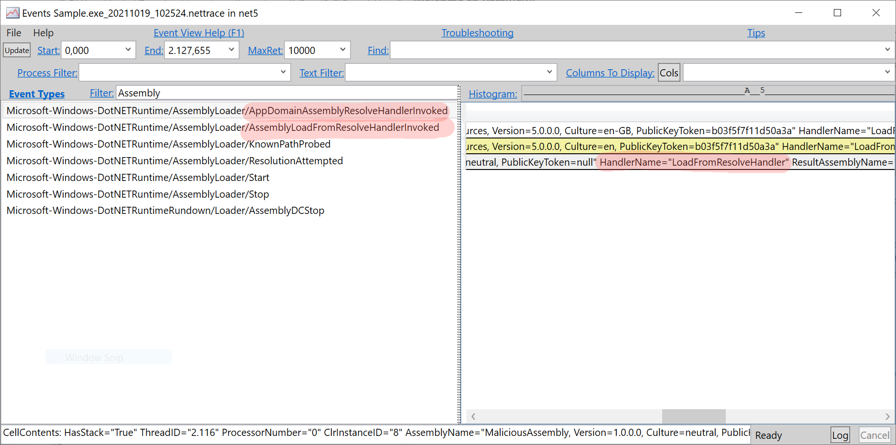

`Type.GetType` is an interesting API. I reliably forget that `Type.GetType` can load types via its `FullName`<sup><a href="#note1">[1]</a></sup> only from the executing assembly and from `mscorlib.dll/System.Private.CoreLib.dll` libraries. For types in any other assembly the API requires the [assembly-qualified name](https://docs.microsoft.com/en-us/dotnet/api/system.type.assemblyqualifiedname?view=net-5.0#System_Type_AssemblyQualifiedName). For the later case, `Type.GetType` will also load said assembly if needed. Well, in most cases...

## The unexpected behavior

NServiceBus (no worries, this post isn't about NServiceBus) can call `Type.GetType` to load user-defined message types. However, running some particular NServiceBus version 8 (preview) sample on .NET Core, I noticed `Type.GetType` returning `null` although the indicated assembly was very clearly sitting right next to the `NServiceBus.Core.dll` in the applications bin folder.

At the same time, running the same sample on .NET Framework loaded the type (and assembly) perfectly well. Now, for people more familiar with this topic (not me), this won't come as a surprise. That is the expected behavior, .NET Core applications don't just resolve assemblies straight from disk. In .NET Core applications, those assemblies typically need to be listed in the `deps.json` file, which they usually will be if you have a project reference in the `.csproj` file. I intentionally did not have this reference, so .NET Core just wholly ignored the desired assembly sitting in front of its face.

There is helpful documentation on the [official documentation about the default `AssemblyLoadContext`'s probing behavior](https://docs.microsoft.com/en-us/dotnet/core/dependency-loading/default-probing) if you're interested in more details. `AssemblyLoadContext` is the new standard API you need to become more familiar with if you want to understand assembly loading in .NET Core.

## The culprit

So the described behavior is expected and relatively well documented. But when I changed my sample to the current stable version of NServiceBus, 7.5, things got more curious. NServiceBus version 7 also runs on .NET Core as it targets .NET Standard 2.0.

With NServiceBus version 7, the type was found using `Type.GetType`, and the containing assembly got loaded. There was no project reference to the said assembly or any entry in the `deps.json`. That baffled me quite a bit. I couldn't explain how the same call to `Type.GetType` running on the same .NET Core application would work with one version of NServiceBus but not with another.

To better understand the resolving behavior, I used `dotnet-trace` to [collect detailed assembly loading logging from the runtime](https://docs.microsoft.com/en-us/dotnet/core/dependency-loading/collect-details). The generated trace file can be loaded with [PerfView](https://github.com/microsoft/perfview) and gives detailed insights into an application's assembly loading/resolution behavior. In these event traces, I noticed that the NServiceBus 7 trace had an event which the version 8 trace did not have: `AppDomainAssemblyResolveHandlerInvoked`. In the event's data, I could see a `Handler` property with the value `LoadFromResolveHandler`. So apparently, there was a special assembly resolver registered that was able to resolve the assembly location. I was pretty sure that NServiceBus itself did not register such a handler.



Digging deeper, I [found the handler in the runtime](https://github.com/dotnet/runtime/blob/45005830255a78caab66cef1757dcb77536f4c0d/src/libraries/System.Private.CoreLib/src/System/Reflection/Assembly.cs#L280). Reading the behavior of this resolve handler, I realized the fairly small difference between NServiceBus 7 and 8 which completely changed the assembly probing behavior:

Since NServiceBus 7 is targeting .NET Standard, it doesn't use the new .NET Core assembly loading APIs (using `AssemblyLoadContext`) yet. Due to some reasons that are not interesting to explain in detail (in this post), NServiceBus 7 invokes `Assembly.LoadFrom("NServiceBus.Core.dll")` to load itself (if you think this doesn't make much sense, you're right, but again, this is a different topic). Calling  `LoadFrom` seems to register that special `AppDomain.AssemblyResolve` handler, while `AssemblyLoadContext.LoadFromAssemblyPath("NServiceBus.Core.dll")` won't do that.

Following the [.NET Core assembly resolving algorithm](https://docs.microsoft.com/en-us/dotnet/core/dependency-loading/loading-managed#algorithm), this handler will be invoked as the final attempt to resolve the requested assembly. And because we're calling `Type.GetType` from an assembly that has been loaded via `Assembly.LoadFrom`, it will now also search the same folder of the requesting assembly (`NServicebus.Core.dll` in this case).

## A simple repro

Mixing in NServiceBus might make this sound quite complicated to digest. We can distill this down into a reasonably simple repro sample:

The following is a .NET Core application. It references another assembly, called `TypeLoader.dll`. `TypeLoader.dll` contains a single, trivial type:

```csharp
public class Loader
{
    public static Type GetDemoClass() => 
        Type.GetType("AssemblyToLoad.DemoClass, AssemblyToLoad, Version=1.0.0.0, Culture=neutral, PublicKeyToken=null");
}
```

There is another assembly in this sample `AssemblyToLoad.dll` which contains an empty class `DemoClass` which we are trying to load. The `AssemblyToLoad.dll` is not referenced in the project file, but the assembly is copied (manually) to the main applications bin folder. Now the actual app looks like this:

```csharp
static void Main(string[] args)
{
    var t = Type.GetType("AssemblyToLoad.DemoClass, AssemblyToLoad, Version=1.0.0.0, Culture=neutral, PublicKeyToken=null"); // this will be null
    Console.WriteLine($"Type.GetType result: {t}");

    var t2 = Loader.GetDemoClass(); // this will be null
    Console.WriteLine($"Loader.GetDemoClass result: {t2}");

    var x = Assembly.LoadFrom("TypeLoader.dll");

    var t3 = Type.GetType("AssemblyToLoad.DemoClass, AssemblyToLoad, Version=1.0.0.0, Culture=neutral, PublicKeyToken=null"); // this will be null
    Console.WriteLine($"Type.GetType result: {t3}");

    var t4 = Loader.GetDemoClass(); // this will be a type reference
    Console.WriteLine($"Loader.GetDemoClass result: {t4}");
}
```

The app calls `Type.GetType` with the assembly-qualified name of `DemoClass`. It won't find it because the assembly is not in the `deps.json` file. The same applies if we try to load this via the `Loader` type.

However, once we load the assembly containing the `Loader` type, `TypeLoader.dll`, via `Assembly.LoadFrom` (which is absolutely unnecessary here because it's already loaded), the situation changes: The app's call to `GetType` still doesn't find the type and continues to return null, but `Loader` now returns the type because the `LoadFromResolveHandler` picked up the `AppDomain.AssemblyResolve` event handler. The `LoadFromResolveHandler` checks the `TypeLoader.dll`'s folder (because we loaded this assembly via `Assembly.LoadFrom`), our app's bin folder, which also contains our target assembly. You can play with this sample yourself, I've uploaded it to [this GitHub repository](https://github.com/timbussmann/TypeLoadDemo), remember to copy the `AssemblyToLoad.dll` to the app's bin folder.

Luckily, chances that you will ever run into issues like this are pretty low, but it was an unexpected change in behavior due to a seemingly meaningless API call. It also shows why you should avoid all `Assembly.Load` APIs when running on .NET Core and instead use the `AssemblyLoadContext` APIs, which aren't easier to use but come with fewer surprises.

Assembly loading remains a non-trivial topic, and having a basic knowledge of the resolving algorithm and debugging/tracing options can save you days of debugging weird application behaviors.

---
<a name="note1">[1]</a>: The official documentation never mentions `FullName` as the string format but describes it as the type's name including its namespace. That all does very much sound like `FullName` to me but I guess there might be some little differences?
