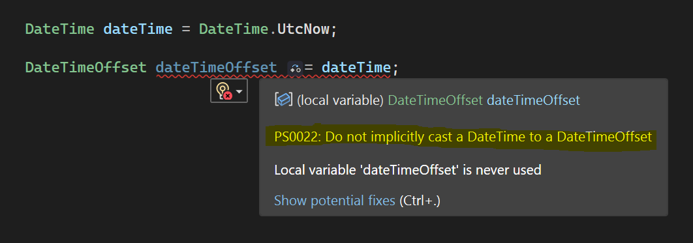
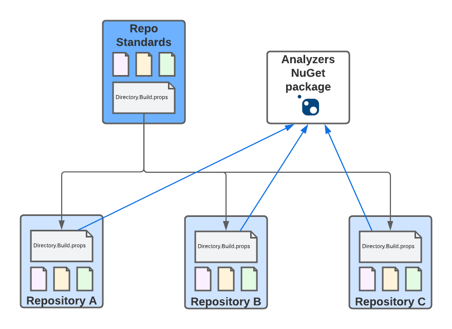

At Particular Software, we do have quite a few repositories to maintain. When writing this, there are about ~75 public repositories (that are not archived) in our organization. Using common repository settings and style checks helps to ensure that the same coding guidelines and practices apply to every repository. But these standards also change, evolve, or need updates.

We have a [standards repository](https://github.com/Particular/RepoStandards) that acts as our baseline, basically like a repository template. The repository contains all the essential files that we want to share across all code repositories, and we make changes to the standard settings here. It contains some pretty common files like:

* `.gitignore` and `.gitattributes`
* Standard license file
* `nuget.config`: We use [our own NuGet feed](https://www.myget.org/F/particular/api/v3/index.json) to publish all sorts of pre-release packages and RTM packages before pushing them to nuget.org. This file ensures that all our projects can directly find and include packages pushed to our feed without the need to pollute nuget.org. If you want to get RTM releases a few minutes earlier or work with our pre-release packages, you can also use our feed.
* virus-scan workflow: This is a [GitHub Action](https://github.com/features/actions) we use in all repositories to scan all releases with a virus scanner automatically.
* dependabot configuration: Dependabot is (after its acquisition) a feature of GitHub that helps us update our (external and internal) dependencies across all repositories. With the number of repositories we have, Dependabot saves a tremendous effort by automating most dependency updates.
* [Stale bot](https://github.com/apps/stale) configuration: This small GitHub app can close abandoned PRs and issues. It's easy to forget some older PRs with this many repositories after some time. Stale bot pings authors of PRs after a while of no progress on a PR and ultimately closes the PR if the issue doesn't seem to be urgent enough.
* `.editorconfig`: We moved to [`.editorconfig`](https://docs.microsoft.com/en-us/visualstudio/ide/create-portable-custom-editor-options) to manage code style settings. All staff members have code style settings imported automatically and supported by major IDEs.
* [Strong-naming](https://docs.microsoft.com/en-us/dotnet/standard/library-guidance/strong-naming) certificates: The certificates are used to sign assemblies that we publish as NuGet packages (we sign the NuGet packages with a separate certificate, of course).
* `Directory.Build.props`: This is what we're going to have a closer look at in this post.

We use Azure Functions to sync these files on a schedule to every repostory that contains a `.reposync` file. That's already quite useful and makes managing shared standards a lot easier. The reposync file also allows to exclude certain files from syncing, in case a repository needs to override the defaults.

Let's look at the `Directory.Build.props` file because this is where the magic for our C# projects (the majority of our codebase) comes from. `Directory.Build.props` is a [particular file to customize the build process](https://docs.microsoft.com/en-us/visualstudio/msbuild/customize-your-build) in MSBuild. It will be automatically picked up if there is such a file inside your folder hierarchy based on the built project file (a targets file also behaves very similar). We can drop this file into our repository via the syncing process. This allows controlling the build behavior for every repository from a central file. Let's look at some interesting parts of that file (check out the [whole file](https://github.com/Particular/RepoStandards/blob/master/src/Directory.Build.props) if you're interested in every single detail):

```xml
<Import Project="Custom.Build.props" Condition="Exists('Custom.Build.props')" />
```

This import happens first, allowing further customization or overrides in a specific repository. Instead of excluding the `Directory.Build.props` in the `.reposync` file and copying the file over manually, create a `Custom.Build.props` next to the `Directory.Build.props`, and it will be run before the following parts in this post.

```xml
<ItemGroup>
    <PackageReference Include="Particular.Analyzers" Version="$(ParticularAnalyzersVersion)" PrivateAssets="All" />
</ItemGroup>
```

A neat feature that allows defining NuGet package references. As you can see, we have a package reference to the `Particular.Analyzers` package. The [Particular.Analyzers](https://github.com/Particular/Particular.Analyzers) package contains code analyzers that detect specific code patterns. This allows us to enforce fairly sophisticated coding guidelines (e.g., handling cancellation tokens, tasks, or dates) and even provide code fixes supported directly by the IDE.



The image shows one of our custom analyzers complaining about implicitly casting a `DateTime` to a `DateTimeOffset`.

Note: An important detail when using `Directory.Build.props` files is that the file detection stops at the first file found. Therefore, nested `Directory.Build.props` do not work out of the box but you can work around this by specifying `<Import Project="$([MSBuild]::GetPathOfFileAbove($(MSBuildThisFile), $(MSBuildThisFileDirectory)..))" Condition="Exists($([MSBuild]::GetPathOfFileAbove($(MSBuildThisFile), $(MSBuildThisFileDirectory)..)))" />` on the nested file. The analyzer repository makes use of this because it registers a [custom `Directory.Build.props` file](https://github.com/Particular/Particular.Analyzers/blob/master/src/Particular.Analyzers/Directory.Build.props) to **remove** the default dependency on the `Particular.Analyzers` package for itself.

There are also these settings we can briefly look into:

```xml
<PropertyGroup>
    <TreatWarningsAsErrors>true</TreatWarningsAsErrors>
    <EnableNETAnalyzers>true</EnableNETAnalyzers>
    <AnalysisLevel>5.0</AnalysisLevel>
    <EnforceCodeStyleInBuild>true</EnforceCodeStyleInBuild>
    <!-- To lock the version of Particular.Analyzers, for example, in a release branch, set this property in Custom.Build.props -->
    <ParticularAnalyzersVersion Condition="'$(ParticularAnalyzersVersion)' == ''">1.8.0</ParticularAnalyzersVersion>
    <NServiceBusKey>0024...3b92</NServiceBusKey>
    <NServiceBusTestsKey>0024...b1c5</NServiceBusTestsKey>
</PropertyGroup>
```

Those are a bunch of code-style-related settings we can skim over quickly:

- `TreatWarningsAsErrors` forces the project build to fail rather than just showing warnings because nobody pays attention to warnings till shit hits the fan (not just in software development, unfortunately).
- `EnableNETAnalyzers` enables the [built-in Roslyn anlyzers](https://docs.microsoft.com/en-us/dotnet/fundamentals/code-analysis/overview) and sets the version of the rules to a specific version using the `AnalysisLevel` property. Note that the Roslyn analyzers are enabled by default anyway, which is redundant, but it's sometimes helpful to be explicit.
- `EnforceCodeStyleInBuild` is another setting related to the Roslyn analyzers that will allow the analyzers to fail the build (this setting is disabled by default).
- `ParticularAnalyzersVersion` is similar to `AnalysisLevel` and locks the imported analyzers package version (the version can be overridden by defining a custom version in a `Custom.Build.props` file).
- Finally, `NServiceBusKey` and `NServiceBusTestsKey` contain the signature of the previously mentioned strong-naming certificates. With those available in MSBuild, [`InternalsVisibleTo`](https://docs.microsoft.com/en-us/dotnet/api/system.runtime.compilerservices.internalsvisibletoattribute) can be used directly in a `.csproj` file like this (since the assembly exposing internals is strong named, the assembly allowing to access internals must also be strong-named):

```xml
<InternalsVisibleTo Include="NServiceBus.Core.Tests" Key="$(NServiceBusTestsKey)" />
```

This post is meant to be a brief overview of how we distribute and maintain repository standards and coding standards across many repositories with little effort and quite powerful capabilities like code analyzers. Thanks to a simple file-syncing mechanism and the `Directory.Build.props` file, we can control every aspect from development to build via a central repository.


