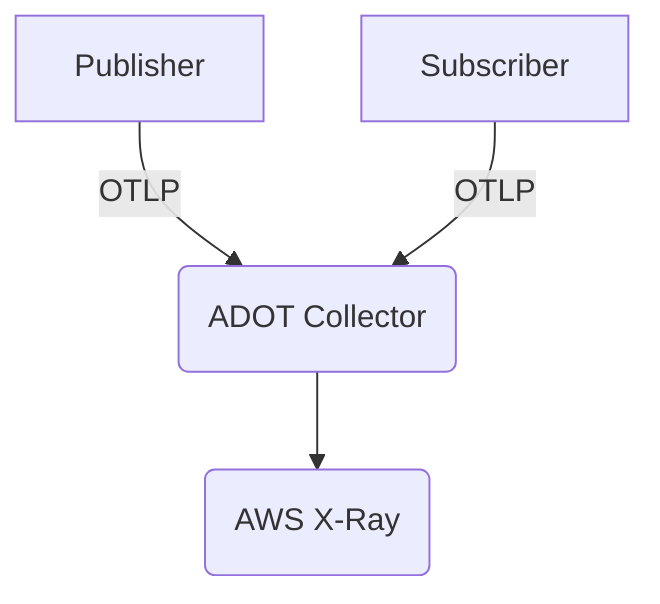

NServiceBus version 8 will come with OpenTelemetry instrumentation to capture message processing traces and metrics and export those to any OpenTelemetry compatible tooling. Some tools like Jaeger or Honeycomb are easy to setup and configure. Others require a bit more effort and AWS X-Ray definitely is one of those. In this post I'm documenting how to configure a .NET application to send NServiceBus (and any other) OpenTelemetry data to X-Ray in a development environment. My development environment is using Windows, WSL2 and Docker, so your experience on a different OS might differ (but I expect it to be simpler).

## NServiceBus OpenTelemetry instrumentation

First of all we're going to use two NServieBus endpoints and configure them to capture distributed tracing data.

I'll start with the [Jaeger sample](https://docs.particular.net/samples/open-telemetry/jaeger/) from NServiceBus and reconfigure it for AWS X-Ray:
1. Remove all references to the `OpenTelemetry.Exporter.Jaeger` NuGet package.
1. Add references to the `OpenTelemetry.Exporter.OpenTelemetryProtocol` and `OpenTelemetry.Contrib.Extensions.AWSXRay` NuGet packages to the `Publisher` and `Subscriber` projects.
1. Replace `.AddJaegerExporter()` with `.AddOtlpExporter()`. We're going to export our trace data using the [OpenTelemetry protocol (OTLP)](https://opentelemetry.io/docs/reference/specification/protocol/).
1. Directly after `CreateTracerProviderBuilder()` add `.AddXRayTraceId()`. This is required for compatibility with X-Ray and should be configured as the first setting.
1. In the `.SetResourceBuilder` setting, change `.AddService(EndpointName)` to `.AddService("Publisher")` or `.AddService("Subscriber")` respectively. X-Ray doesn't like resource names with dots apparently, so we need to avoid those.

Make sure all these steps are done for both the `Publisher` and the `Subscriber` project.

## Export to X-Ray

Unlike other OpenTelemetry exporters, X-Ray integration happens via a dedicated collector from the AWS Distro for OpenTelemetry (ADOT) project. The .NET application will export OpenTelemetry data via the OpenTelemetry protocol to the ADOT collector which in turn will export the collected data to AWS X-Ray.



Let's get started:

1. Make sure to have AWS CLI installed locally. See the [installing AWS CLI docs](https://docs.aws.amazon.com/cli/latest/userguide/getting-started-install.html) otherwise.
1. Make sure your account is correctly configured in the AWS CLI (via `aws configure`) by following the [configuration documentation](https://docs.aws.amazon.com/cli/latest/userguide/cli-configure-quickstart.html).
1. Configure the [necessary IAM permissions](https://aws-otel.github.io/docs/setup/permissions) so that the ADOT Collector can submit data to X-Ray.
1. Create an ADOT Collector configuration file (I'll name it `collector-config.yaml`). Start with [this template](https://github.com/aws-observability/aws-otel-dotnet/blob/main/integration-test-app/collector-config-local.yml) and change the `region` values to your default region.
1. Start the ADOT Collector locally using docker with this command:
1. Start a terminal in the same folder as `collector-config.yaml`. To run the following commands I'm switching to bash (just type `bash`) since it's easier to copy & paste the samples from the AWS documentation ;) Make sure to replace the `AWS_REGION` value with your default region.

```
docker run --rm -p 4317:4317 -p 55680:55680 -p 8889:8888 \
    -e AWS_REGION=us-west-2 \
    -e AWS_PROFILE=default \
    -v ~/.aws:/root/.aws \
    -v "${PWD}/examples/docker/collector-config.yaml":/otel-local-config.yaml \
    --name awscollector public.ecr.aws/aws-observability/aws-otel-collector:latest \
    --config otel-local-config.yaml;
```

You should see the following line in the console output (along with plenty of other log statements):

`info    service/collector.go:128        Everything is ready. Begin running and processing data.`

## Run the sample

Run the sample app and press `[1]` on the `Publisher` endpoint to produce a few messages. If we got our X-Ray instance, we should now see traces being captured:


We can drill into a trace by clicking on it to see more details about the message flow of that trace:


Compared to other OpenTelemetry tooling, like [Jaeger](https://www.jaegertracing.io/) the X-Ray visualization are missing a lot of details, e.g. showing the different endpoints involved in a trace. It's very likely that there is further configuration and instrumentation required to fully use X-Rays capabilities but other tooling definitely seems to be a step ahead with OpenTelemetry compatibility so far.